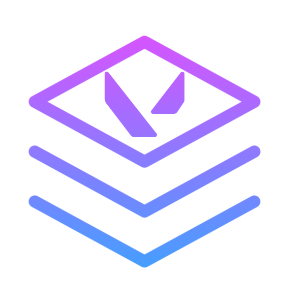

# A Community made VALORANT Tournament Overlay
> This is made by the community and is not affiliated with Riot Games and/or VALORANT.



### Warning
This repo is under construction and is not complete yet. For now only the visual assets are working but the main server and data recognition is not built yet.

### The concept
We always wanted to have a real tournament overlay for community hosted events. As it seems like Riot only gives access to their "VCT Style" overlay to prominent groups (OfflineTV, AfreecaTV, ...) we tried to replicate the overlay as much as possible in the form of an HTML overlay and a user downloadable Overwolf app that sends the required data to the server in order to be shown on screen.

### Setup Host Server
- Download or clone the repository in a desired folder
- Download all dependencies needed for the program to work (fs, express)
- Make sure that the place where you will run the application has an open endpoint accessible from outside your local network.
- start the server client with ```node .```
- Go to either, ```/pannel``` to access the control pannel where you can change the map picks and more or go to ```/``` to see all possible endpoints for overlays and the possibility to copy them for adding in OBS. (Note that you'll need to update the ```admin_password``` field in the ```game_config.json``` to access the pannel.)

### Setup Client Apps
- Each user in your VALORANT game must have downloaded Overwolf and the coresponding HelveticaOverlay app.
- On startup, the app will ask the user for a 'game_token' and an 'endpoint'. The token is given by the tournament organiser and the endpoint will be what you've defined the hosts entrypoint to be, for example ```  {yourcustomdomain.com}//```
- The user's client will the connect to the host and start transmitting data.

### Adding sources to OBS (Open Broadcast Software)
- Download OBS if not already done at [this link](https://obsproject.com/)
- Create your scenes and add a ```Browser Source``` to your scene.
- In the browser add the different pages available to you. For example ```/game_score``` or ```map_picks```. A full list of all visual assets can be found at ```/```
- Chose the corresponding page for each overlay component you'd like to add to your stream. (note that pages with moving assets on it like timeout timers are set to restart their animation on reload, thus you'll need to check the 'refresh browser on scene active' for your scenes.)

### Functionalites
This is a comprehensive list of all planned and currently working functionalities that this repository contains.

##### Local function (no need for server data)
- Custom Scoreboard Styling. (WIP)
- Custom map picks on top left of screen (Local done, server WIP)
- Custom Halftime and Timeout timers. (Done)
##### Server dependent functions
- Map pick overlay (Done)
- Map pick selector, admin only (WIP)
##### Misc functions
- Streamdeck compatibility (WIP)

### Examples

> Used to display which map is currently played and which one is up next. Works with either manual local data modification or with server data fetching.


> Built to resemble the official VCT overlay, the top part of the screen boasts information on the team seeding, maps won in the series (small diamond shapes), round counter and timer and information on who has to plant the spike (indicated by the small arrow pointing to either team)


> Player Scores progress, player healt, ult points, agent, and name are displayed as in the VCT. The overlay updates every second by getting information from the main application server. Right now editing the json file live also updates the overlay.

### References

> VCT Overlay from which the overlay is extremely inspired (made to look almost identical)

[Valorant Fandom](https://valorant.fandom.com/wiki/VALORANT_Wiki)
> All assets that originate from inside the game are taken from there. (Agent icons, gun icons, game icons, etc...)
### Thanks
