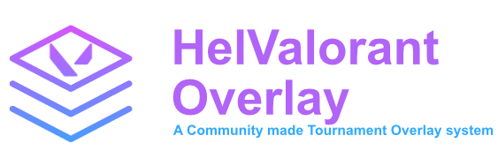

# A Community made VALORANT Tournament Overlay
> This is made by the community and is not affiliated with Riot Games and/or VALORANT.



### Warning
```diff
- This Repository is under construction and is not working yet ! Developpment is underway but slowed drastically by my current service at the swiss army. Only visualy assets are working right now but they are STATIC, meaning there is currently no way to get them to update live from a game
```

### Content
>[Introduction](#the-concept)\
>[App Setup](#setup-host-server)\
>[Client App Setup](#setup-client-app)\
>[Adding Scenes to OBS](#adding-sources-to-obs-open-broadcast-software)\
>[FAQ](./FAQ.md)\

### The concept
We always wanted to have a real tournament overlay for community hosted events. As it seems like Riot only gives access to their "VCT Style" overlay to prominent groups (OfflineTV, AfreecaTV, ...) we tried to replicate the overlay as much as possible in the form of an HTML overlay and a user downloadable Overwolf app that sends the required data to the server in order to be shown on screen.
We aim to create the best possible overlay for smaller communities that would like to host VALORANT events. The overlay should resemble the VCT overlay as much as possible without needing tournament organizers to be registered and partnered with Riot Games.
The main app works as a central server hosting ```.html``` files such as ```.json``` files. The overlays refresh every second by querying the files on the server. At the same time, each player in the current game will be sending their game state through the ```Overwolf App``` every second. The data is the parsed and stored in the files on the server thus updating the overlay on it's next update.

### Setup Host Server
- Download or clone the repository in a desired folder
- Download all dependencies needed for the program to work (fs, express)
- Make sure that the place where you will run the application has an open endpoint accessible from outside your local network.
- start the server client with ```node .```
- Go ```/``` to access a greeting page with all the possible endpoints for overlays and for admin panels. Note that you'll need to update the admin password in the ```app_config.json```file as the default password is ```password```. The admin panel allows you to manage everything in the overlay.

### Setup Client App
- Each user in your VALORANT game must have downloaded Overwolf and the coresponding HelValorant Overlay app.
- On startup, the app will ask the user for a 'game_token' and an 'endpoint'. The token is given by the tournament organiser and can be generated in the admin panel. The endpoint will be what you've defined the hosts entrypoint to be, for example ```  {yourcustomdomain.com}/```
- The user's client will then connect to the host and start transmitting data as soon as the valorant game starts.
- The admin can then invalidate tokens after the game session is over thus terminating the transmission of data to the server of non-players.

### Adding sources to OBS (Open Broadcast Software)
- Download OBS if not already done at [this link](https://obsproject.com/)
- Create your scenes and add a ```Browser Source``` to your scene.
- In the browser add the different pages available to you. For example ```/game_score``` or ```map_picks```. A full list of all visual assets can be found at ```/```
- Choose the corresponding page for each overlay component you'd like to add to your stream. (Don't forget to set the source's resolution to be 1920x1080 for best results)


### Examples

> Used to display which map is currently played and which one is up next. Works with either manual local data modification or with server data fetching.


> Built to resemble the official VCT overlay, the top part of the screen boasts information on the team seeding, maps won in the series (small diamond shapes), round counter and timer and information on who has to plant the spike (indicated by the small arrow pointing to either team)


> Player Scores progress, player healt, ult points, agent, and name are displayed as in the VCT. The overlay updates every second by getting information from the main application server. Right now editing the json file live also updates the overlay.

### References

> VCT Overlay from which the overlay is extremely inspired (made to look almost identical)

[Valorant Fandom](https://valorant.fandom.com/wiki/VALORANT_Wiki)
> All assets that originate from inside the game are taken from there. (Agent icons, gun icons, game icons, etc...)
